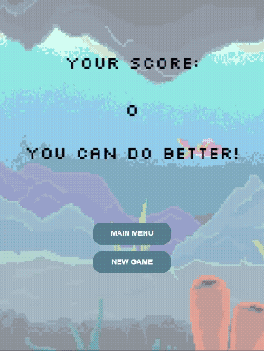
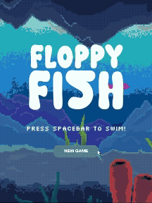
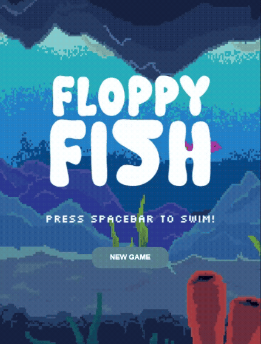
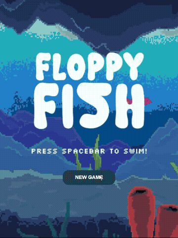

# Mini Project — Floppy Fish

---

### The Project

This project was made by Jacee and Isaac.
We wanted to conceptualize flappy bird as a fish, as it gave us opportunity to play with the physics and artwork while still retaining the core mechanic of the game.


The original flappy bird had the pipe image reversed, but we wanted to explore in more depth on how image worked, so we chose stalagmites for the ceiling and corals at the bottom. All of the assets were made by Jacee.

We added in a start and home screen and an equivilant of a award/ point ranking system, instead of a medal, the player gets a fish pun as encouragement depending on the points scored. 

---

### Output






[Watch Online](https://youtube.com/shorts/IpTbBJ9JNMU?si=caIDEdD_bkaLbMB8)

---

### ✍️ Reflection

Working on a game was a very novel experience for me. I always wanted to make a game, but I never coded or programmed before, so it was a bit intimidating.

The first hurdle we faced was actually understanding how the base code operated.
How one person might intuitively write code might not read the same easily to another.
Found that trying to write it down and draw out how the code works, especially for pipes was particularly helpful.

We conceptualized the game as a fish swimming instead of a bird flying, partly as we wanted to experiment with the physics and make the control more floaty, though we decided against it as it felt not pleasing to play.

We wanted to mimic the slight rotation that Flappy Bird had with the character. We had to introduce a rotateFish and added in increasing positive values to the apply force and negative to the flap functions within the Bird class (which is visually a fish).

One thing we wanted was to have nice buttons, purely for aesthetic purposes, discovering the wonders of .style(). One thing we could not overcome however was getting the font to work for the buttons.

I wanted a bit of a ‘impact’ when the player loses. Referencing old arcade games that flashes when you loose, I thought I could simply minus the frameCount function, but found that it did not work. So instead, I created an independent frame counter that reference the frameCount when the player looses, and resets itself every time to then trigger a flashing condition for a set time period.

The biggest challenge was understanding the scrolling background; something about the translation from concept to code was like a wall. Perhaps that scroll speed was simply subtracting the X position every frame count was a bit tricky to understand.

Another challenge was mapping an image draw from bottom up rather than top down.
This led to discovering imageMode(CORNERS) changes the draw points to 1X 1Y, 2X 2Y. Conceptualising 1X as -units from 2X made it click.

Regarding creating the visuals, we chose to do pixel art and since it was our first time, there were challenges such as having to place each pixel well to convey shapes and lighting clearly. One technique that helped us convey the underwater visual better was ‘dithering ’, which created the illusion of midtones.

One issue we had towards the end was a strange black flickering in the background that turned up after one of us made several changes to the code, and we had to compare the new and old version to see what went wrong.

It was encouraging to see the final work come together into something fun and playable.

<!-- 200–300 words on your process. Write freely — this isn't an essay.
     Some prompts to get you started:
     — What did you set out to make, and how did the result compare?
     — What inputs does your sketch respond to, and how did you approach that?
     — What was your biggest challenge, and how did you work through it?
     — What would you push further if you had more time? -->

---

<!-- ─────────────────────────────────────────────────────
     GOING FURTHER — want to document more? Try any of these:

     ### ✨ What I Changed
     A short list of the additions and modifications you made to the scaffold.
     - Changed the paddle to use mouse tracking instead of keyboard
     - Redesigned the visual language with a retro CRT aesthetic

     ### 🔍 Code Structure
     Briefly explain how your files are organised.
     - `sketch.js` — main game loop
     - `Ball.js` — ball class with collision logic
     - `assets/` — sprites and sounds

     ### 🧩 Something I'm Proud Of
     A snippet of code, a design decision, a moment where it clicked.
     ```js
     // your code here
     ```

     ### 🔗 References
     Anything that helped or inspired you — tutorials, artworks, tools.
     ───────────────────────────────────────────────────── -->
